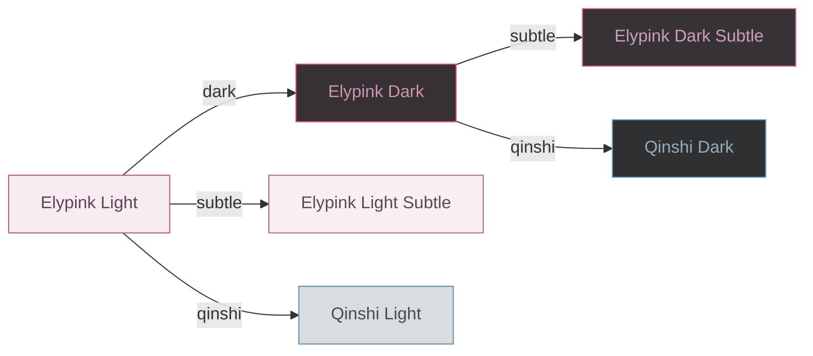

# Elypink Theme

A theme addon for Visual Studio Code (and compatible software).


## Theme List

### Light

- Elypink Light — Pink base theme
- Elypink Light Subtle — 20% reduced saturation
- Qinshi Light — Auspicious cyan for hackers

### Dark

- Elypink Dark — Pink dark theme
- Elypink Dark Subtle — 20% reduced saturation dark
- Qinshi Dark — Auspicious cyan for hackers, dark


## Scripts

All themes are generated from a single source file `themes/elypink-light.json` using color transformation scripts.



``` bash
# Execution order
node scripts/generate-dark.js
node scripts/generate-qinshi.js
node scripts/generate-subtle.js
```


## License

MIT
