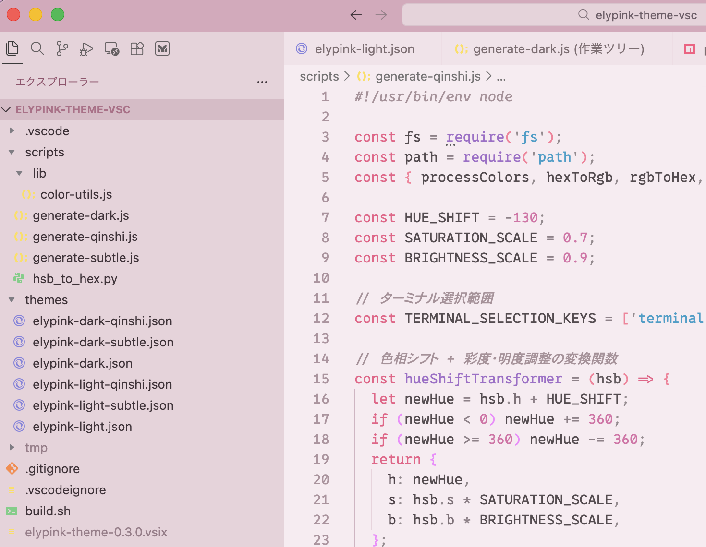
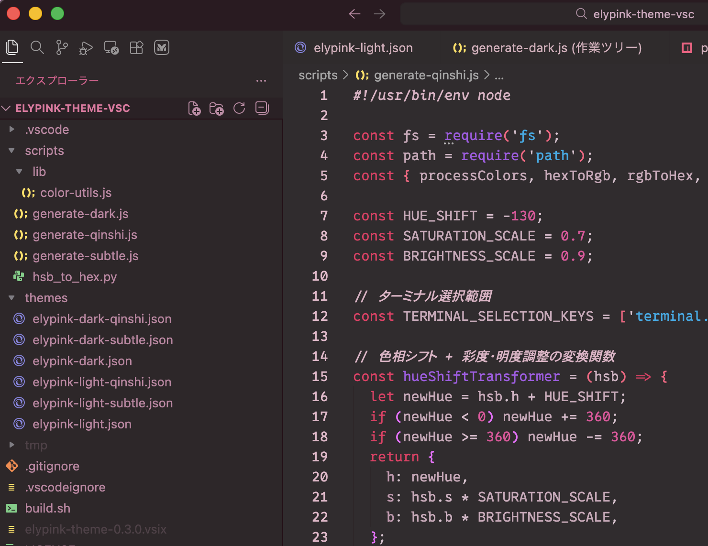

# Elypink Theme

A pink-based theme collection for Visual Studio Code and VSCodium.

- [日本語](README-ja.md)
- [简体中文](README-zh.md)

## Features

- Pink-based color palette — Warm and soft visual experience
- Contrast-optimized — Designed with WCAG/APCA contrast calculations for readability
- Color-filtered variants — Multiple variants with different color transformations
- Light & Dark modes — Each variant available in both modes

## Theme Variants

### Light

| Theme | Description |
|-------|-------------|
| Elypink Light | Standard pink theme (recommended) |
| Elypink Light (Faded) | Cyan-shifted UI with hue rotation |
| Elypink Light (Spring) | Warm red-pink overlay |
| Elypink Light (Summer) | Cool blue overlay |
| Elypink Light (Diamond) | Fresh cyan overlay |

### Dark

| Theme | Description |
|-------|-------------|
| Elypink Dark | Standard pink dark theme |
| Elypink Dark (Faded) | Cyan-shifted UI with hue rotation |

## Installation

### VS Code / VSCodium

Search for "Elypink" in the Extensions marketplace.

### Manual

1. Download the `.vsix` file from [Releases](https://github.com/barineco/elypink-theme-vsc/releases)
2. Run: `code --install-extension elypink-theme-*.vsix`

## License

MIT